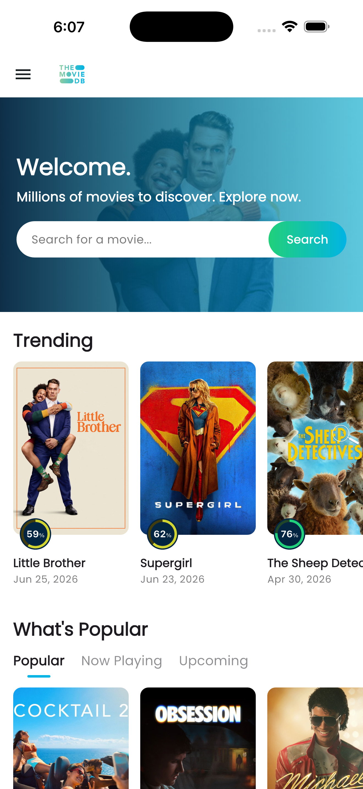
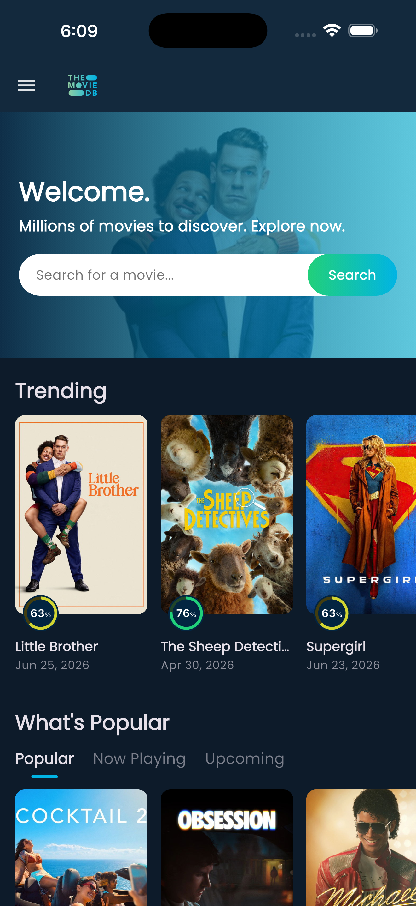
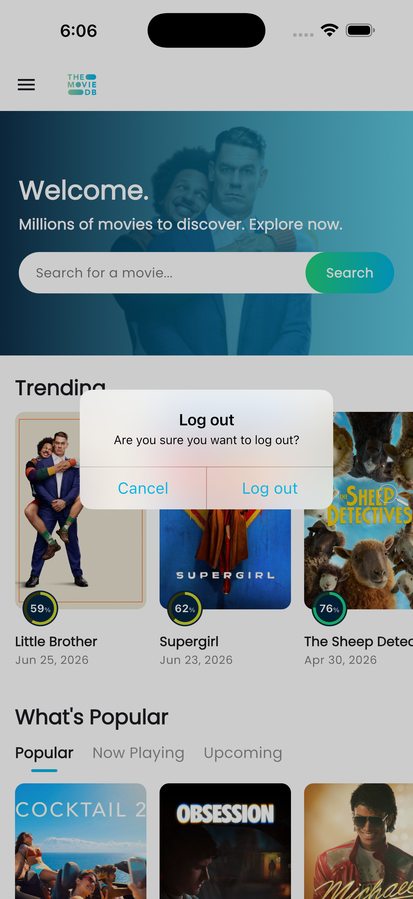
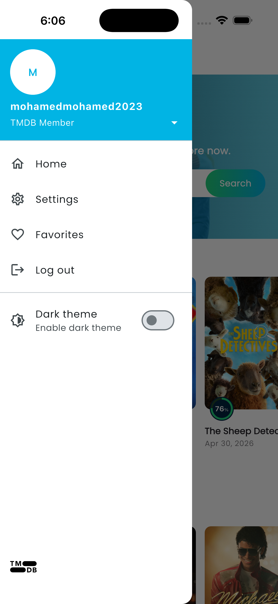
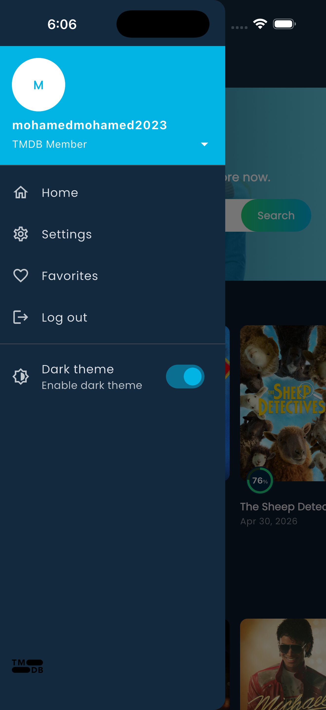
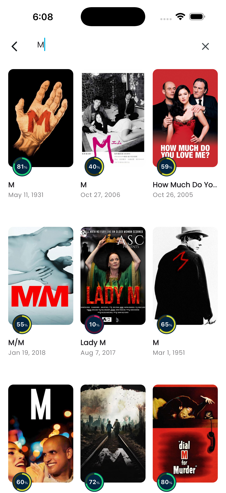
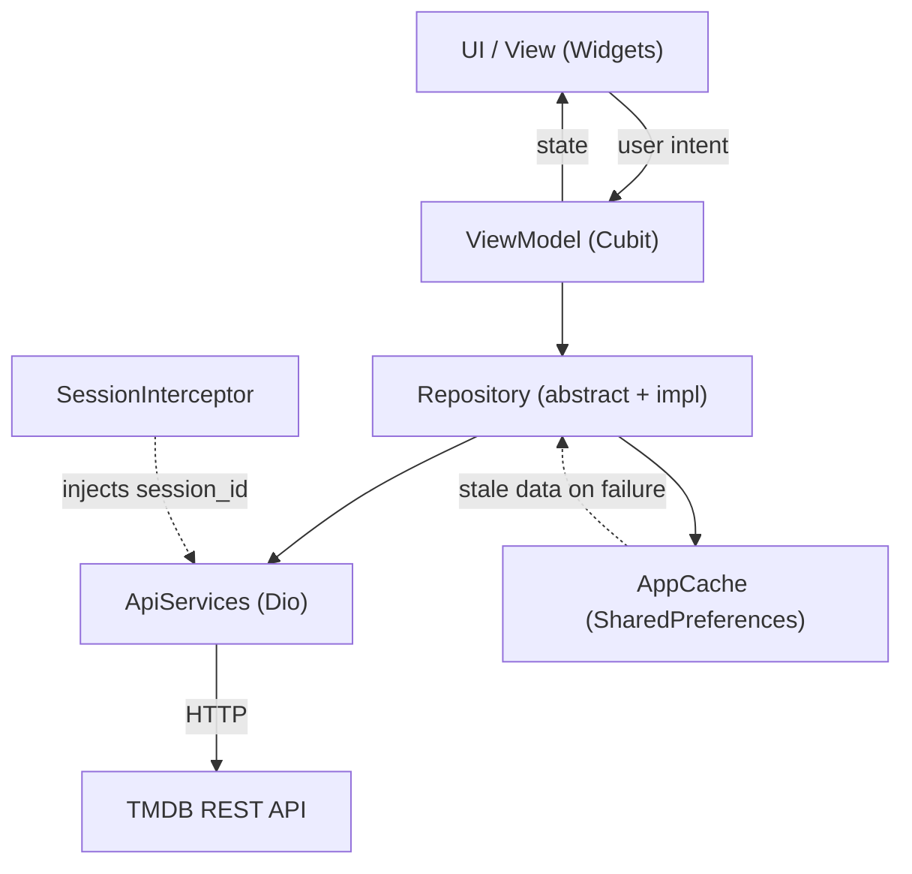
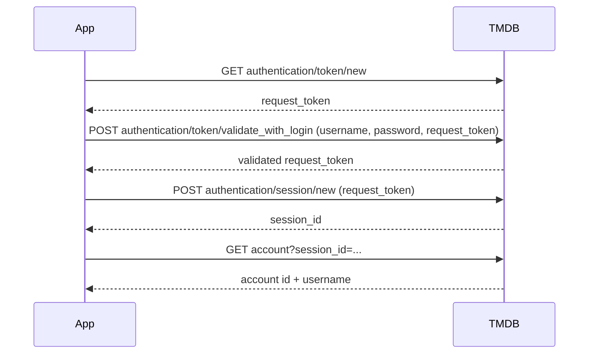

# Movie App (TMDB)

A Flutter movie browser built on top of [The Movie Database (TMDB)](https://www.themoviedb.org/). It lets you explore trending, popular, now-playing and upcoming movies, search the full TMDB catalogue, open rich movie detail pages (trailer, overview, cast, similar, recommendations and where-to-watch providers), sign in with a real TMDB account, and manage your favorites. It ships with dark mode, offline caching, smooth animations and pull-to-refresh.

> The project name in `pubspec.yaml` is `task_electro_pi`; the in-app title is "Movie App".

---

## Table of contents

- [Screenshots](#screenshots)
- [Features](#features)
- [Powered by TMDB](#powered-by-tmdb)
- [Architecture (MVVM + clean layers)](#architecture-mvvm--clean-layers)
- [Project structure](#project-structure)
- [State management](#state-management)
- [Routing (go_router)](#routing-go_router)
- [Authentication (login & logout)](#authentication-login--logout)
- [Offline support & local caching](#offline-support--local-caching)
- [Error handling](#error-handling)
- [Reusable widgets](#reusable-widgets)
- [Theming & dark mode](#theming--dark-mode)
- [Pull-to-refresh](#pull-to-refresh)
- [Animations](#animations)
- [Search](#search)
- [Favorites](#favorites)
- [Movie details](#movie-details)
- [Packages used](#packages-used)
- [iOS: Swift Package Manager (not CocoaPods)](#ios-swift-package-manager-not-cocoapods)
- [Test the app (download APK)](#test-the-app-download-apk)
- [Getting started](#getting-started)

---

## Screenshots

| Home (light) | Home (dark) | Logout dialog |
| --- | --- | --- |
|  |  |  |

| Drawer (signed in) | Drawer (dark) | Drawer (guest) |
| --- | --- | --- |
|  |  |  |

| Login | Favorites | Search |
| --- | --- | --- |
|  |  |  |

---

## Features

- **Authentication** — real TMDB login and logout, with the session/token persisted in local cache.
- **Browse movies** — Trending carousel plus a tabbed list for Popular / Now Playing / Upcoming.
- **Search** — debounced (400 ms) full-catalogue search with empty/loading/error states.
- **Movie details** — backdrop + poster header, user score, watch trailer, overview, where-to-watch providers, cast, similar and recommended movies.
- **Favorites** — add/remove favorites against your TMDB account, with optimistic UI and infinite scroll pagination.
- **Dark mode** — Material 3 light/dark themes, persisted across launches, with an animated theme switch.
- **Offline support** — home movie lists are cached locally and served when the network is unavailable.
- **Pull-to-refresh** — on Home and Favorites.
- **Animations** — Hero poster transitions, animated tab indicator, and fade/slide route transitions.

---

## Powered by TMDB

This product uses the TMDB API but is not endorsed or certified by TMDB.

- TMDB website: https://www.themoviedb.org/
- TMDB API getting started: https://developer.themoviedb.org/reference/getting-started

API configuration lives in [`lib/core/utils/app_strings.dart`](lib/core/utils/app_strings.dart):

- Base URL: `https://api.themoviedb.org/3/`
- Image base URL: `https://image.tmdb.org/t/p/w500`
- A demo `api_key` is included for convenience. For your own deployment, replace it with your own TMDB API key.

---

## Architecture (MVVM + clean layers)

The app follows the layered, MVVM-style architecture recommended by the official Flutter guide:
https://docs.flutter.dev/app-architecture/guide

Each feature is split into three clearly separated layers:

- **UI layer (`ui/`)** — `View` widgets/screens. They only render state and forward user intent to a Cubit. No business logic or networking here.
- **Business logic layer (`viewmodel/`)** — `Cubit`s act as the ViewModel. They hold UI state, call repositories, and expose immutable state objects.
- **Data layer (`data/`)** — `model` (typed DTOs with `fromJson`/`toJson`) and `repository` (abstract contract + implementation). Repositories talk to the remote API and the local cache, returning `Either<Failure, T>`.



Cross-cutting pieces live in `lib/core`:

- Dependency injection via `get_it` ([`service_locator.dart`](lib/core/utils/service_locator.dart)).
- A single `Dio` instance configured with base URL, timeouts, the `api_key` query param, a `SessionInterceptor`, and (in debug) `PrettyDioLogger`.
- `Either<Failure, T>` from `dartz` for typed success/error results.

---

## Project structure

```text
lib/
├── main.dart                         # App bootstrap, MultiBlocProvider, MaterialApp.router
├── core/
│   ├── constants/
│   │   └── app_assets.dart           # Local asset paths + TMDB logo URL
│   ├── errors/
│   │   ├── failure.dart              # Abstract Failure (message)
│   │   ├── server_failure.dart       # Maps Dio/HTTP errors to friendly messages
│   │   └── api_error_response.dart   # Parses TMDB error JSON
│   ├── themes/
│   │   ├── app_colors.dart           # TMDB brand palette
│   │   ├── app_theme.dart            # Material 3 light/dark themes
│   │   └── theme_text.dart           # Poppins (google_fonts) text theme
│   └── utils/
│       ├── api_services.dart         # Thin Dio wrapper (get/post/delete)
│       ├── app_cache.dart            # SharedPreferences wrapper
│       ├── app_router.dart           # GoRouter config + auth redirect + transitions
│       ├── app_strings.dart          # Endpoints, keys, base URLs, defaults
│       ├── go_router_refresh_notifier.dart # Re-evaluates redirects on session change
│       ├── my_bloc_observer.dart     # Debug Bloc logging
│       ├── service_locator.dart      # get_it registrations
│       ├── session_interceptor.dart  # Injects session_id into requests
│       └── url_launcher_helper.dart  # Open external URLs / YouTube trailer
└── feature/
    ├── signin/      # data (model/repo), viewmodel (login + session cubits), ui (login screen)
    ├── logout/      # viewmodel (logout cubit), ui (logout dialog)
    ├── movies/      # data (models/repo), viewmodel (carousel/tabbed/details cubits), ui (home, details, widgets, drawer)
    ├── search/      # viewmodel (search cubit), ui (search screen)
    ├── favorites/   # data (repo), viewmodel (favorites cubit), ui (screen + heart button)
    ├── theme/       # viewmodel (theme cubit)
    └── settings/    # ui (settings screen)
```

---

## State management

State is managed with `flutter_bloc` (Cubits). Two complementary state styles are used in the codebase:

- **Enum status + data + `errorMessage`** for data-driven screens — `MovieCarouselCubit`, `MovieTabbedCubit`, `MovieDetailsCubit`, `SearchCubit`, `FavoritesCubit`. Each state has a `*Status` enum (`initial`, `loading`, `success`, `failure`, and `empty` for search) plus the loaded data and an optional `errorMessage`.
- **Class-based states** for simpler flows — `LoginCubit` (`LoginInitialState` / `LoginLoadingState` / `LoginSuccessState` / `LoginFailureState` / `ObscureToggleState`), `LogoutCubit`, and `ThemeCubit`.

Loading and error handling pattern:

- Cubits emit `loading` before a request, then `success` (with data) or `failure` (with `errorMessage`).
- States are immutable and updated via `copyWith(...)`; errors are cleared on reload using `copyWith(clearErrorMessage: true)`.
- `MyBlocObserver` logs cubit lifecycle/changes/errors in debug builds.

---

## Routing (go_router)

Routing is handled by `go_router` in [`app_router.dart`](lib/core/utils/app_router.dart).

| Path | Name | Screen |
| --- | --- | --- |
| `/` | `home` | `HomeScreen` |
| `/details` | `details` | `MovieDetailsScreen` (movie passed via `extra`) |
| `/search` | `search` | `SearchScreen` |
| `/settings` | `settings` | `SettingsScreen` |
| `/login` | `login` | `LoginScreen` |
| `/favorites` | `favorites` | `FavoritesScreen` (auth-guarded) |

- **Auth guard** — `authRedirect` redirects unauthenticated users away from `/favorites` to `/login?redirect=/favorites`, and sends already-authenticated users away from `/login` (honoring the `redirect` query param).
- **Refresh on auth change** — `GoRouterRefreshNotifier` listens to `SessionCubit.stream` so redirects are re-evaluated immediately after login/logout.
- **Custom transitions** — `buildFadeSlidePage` wraps routes in a combined fade + slide `CustomTransitionPage`.

---

## Authentication (login & logout)

Login uses the official TMDB user-authentication flow ([`auth_repository_impl.dart`](lib/feature/signin/data/repository/auth_repository_impl.dart)):



- On success, `LoginCubit` persists to local cache via `AppCache`: `session_id`, `account_id`, `username`, plus `saved_username` / `saved_password` (used to pre-fill the login form), then updates `SessionCubit` and preloads favorites.
- `SessionInterceptor` automatically appends `session_id` as a query param to every request while logged in.
- On startup, `SessionCubit.loadSession()` rehydrates the session from cache, so the user stays logged in.
- **Logout** ([`logout_cubit.dart`](lib/feature/logout/viewmodel/logout_cubit.dart)) calls `DELETE authentication/session` (best-effort), clears the auth keys from cache, and resets both `SessionCubit` and `FavoritesCubit`.

> A demo TMDB account is pre-filled on the login screen (defined in [`app_strings.dart`](lib/core/utils/app_strings.dart)).

---

## Offline support & local caching

Local caching is implemented in the repository layer using `SharedPreferences` (wrapped by [`AppCache`](lib/core/utils/app_cache.dart)).

`MovieRepositoryImpl.fetchMovies()` ([`movie_repository_impl.dart`](lib/feature/movies/data/repository/movie_repository_impl.dart)) powers the four home lists. On a successful response it stores the raw `results` JSON; on any network failure it falls back to the cached data so the home screen still renders.

| Cache key | Endpoint |
| --- | --- |
| `cache_trending_movies` | `trending/movie/day` |
| `cache_popular_movies` | `movie/popular` |
| `cache_now_playing_movies` | `movie/now_playing` |
| `cache_coming_soon_movies` | `movie/upcoming` |

Other cached values: the session keys above and the dark-mode preference (`is_dark_mode`). Search, movie details and favorites are fetched live (not cached).

---

## Error handling

- Repositories return `Either<Failure, T>` (`dartz`). The `Left` side carries a `Failure`.
- [`ServerFailure`](lib/core/errors/server_failure.dart) maps every `DioExceptionType` (timeouts, connection errors, cancel, bad response) and HTTP status codes (401/403/404/500) to clear, user-friendly messages, e.g. "No internet connection".
- TMDB error payloads are parsed by [`ApiErrorResponse`](lib/core/errors/api_error_response.dart) to surface the API's own `status_message`.
- The UI presents errors via SnackBars and inline placeholder widgets, and lets the user retry via pull-to-refresh.

---

## Reusable widgets

UI is composed from small, reusable widgets (mostly under [`lib/feature/movies/ui/widgets`](lib/feature/movies/ui/widgets)):

- **`TmdbAppBar`** — home app bar with the TMDB logo.
- **`HeroBanner`** — welcome banner with a tappable search bar that routes to `/search`.
- **`SectionHeader`** — bold section title with consistent padding.
- **`PopularTabs`** — Popular / Now Playing / Upcoming tabs with an animated underline indicator.
- **`HorizontalMovieList`** — fixed-height horizontal list of poster cards.
- **`MoviePosterCard`** — poster + score ring + title + date; taps navigate to details (with an optional Hero tag).
- **`ScoreRing`** — circular vote-percentage badge (green/yellow/red by score).
- **`CastMemberTile`** — circular actor photo with name and character.
- **`WatchProviderTile`** — provider logo and name.
- **`AppNavigationDrawer`** — auth-aware side drawer (Home, Settings, Favorites, Log out, dark-mode toggle).
- **`FavoriteHeartButton`** — favorite toggle used on the details screen.

---

## Theming & dark mode

- Material 3 themes built in [`app_theme.dart`](lib/core/themes/app_theme.dart) via `ColorScheme.fromSeed(seedColor: AppColors.tmdbBlue)` for both light and dark brightness, with custom AppBar, drawer, card and switch styling.
- Typography uses **Poppins** via `google_fonts` ([`theme_text.dart`](lib/core/themes/theme_text.dart)).
- `ThemeCubit` ([`theme_cubit.dart`](lib/feature/theme/cubit/theme_cubit.dart)) toggles and persists the choice to `is_dark_mode`. On first launch it follows the platform brightness.
- The theme switch is animated (`themeAnimationStyle` in [`main.dart`](lib/main.dart)). Toggle it from the navigation drawer or the Settings screen.

---

## Pull-to-refresh

Implemented with Flutter's built-in `RefreshIndicator`:

- **Home** ([`home_screen.dart`](lib/feature/movies/ui/home_screen.dart)) — `refreshHomeContent()` reloads the trending carousel and the currently selected popular tab in parallel via `Future.wait`. The list uses `AlwaysScrollableScrollPhysics` so it can always be pulled.
- **Favorites** ([`favorites_screen.dart`](lib/feature/favorites/ui/favorites_screen.dart)) — pulling calls `FavoritesCubit.loadFavorites()`, resetting back to page 1.

---

## Animations

- **Hero transitions** — poster images animate from list/grid into the details screen using scoped Hero tags.
- **Animated tab indicator** — the popular-tabs underline slides between tabs.
- **Route transitions** — combined fade + slide on navigation (`buildFadeSlidePage`).
- **Theme animation** — animated cross-fade when switching light/dark.

---

## Search

[`SearchCubit`](lib/feature/search/viewmodel/search_cubit.dart) debounces input by 400 ms before calling `search/movie`. An empty query resets to the initial state; results render in a poster grid, with dedicated loading, empty and error states.

---

## Favorites

[`FavoritesCubit`](lib/feature/favorites/viewmodel/favorites_cubit.dart) manages favorites against the TMDB account:

- **Toggle** — `POST account/{accountId}/favorite` with `{ media_type: "movie", media_id, favorite }`. The UI updates optimistically and reverts if the request fails.
- **Load & pagination** — `GET account/{accountId}/favorite/movies?page=N`; the Favorites screen infinite-scrolls (loads the next page when near the bottom) and supports pull-to-refresh.
- A `favoriteIds` set drives the heart button's selected state across the app.

---

## Movie details

[`MovieDetailsCubit`](lib/feature/movies/viewmodel/details/movie_details_cubit.dart) loads five endpoints in parallel (`Future.wait`) for a given movie id and tolerates partial success:

| Section | Endpoint | Notes |
| --- | --- | --- |
| Cast | `movie/{id}/credits` | First 15 cast members |
| Trailer | `movie/{id}/videos` | Picks a YouTube "Trailer" via `VideoModel.selectYoutubeTrailer` |
| Similar | `movie/{id}/similar` | Up to 10 (excludes the current movie) |
| Recommendations | `movie/{id}/recommendations` | Up to 10 (excludes the current movie) |
| Where to watch | `movie/{id}/watch/providers` | US region; Stream / Rent / Buy |

The [details screen](lib/feature/movies/ui/movie_details_screen.dart) shows a backdrop `SliverAppBar`, poster + title + user score header, a "Watch Trailer" button (opens YouTube externally), the overview, watch providers (with a "View on TMDB" link), cast, and similar/recommended rows. The base movie data (title, poster, overview, score) is passed via route args, so it renders instantly while the extra sections load.

---

## Packages used

From [`pubspec.yaml`](pubspec.yaml):

| Package | Purpose |
| --- | --- |
| `flutter_bloc` / `bloc` | State management (Cubit/Bloc) |
| `get_it` | Service locator / dependency injection |
| `dio` | HTTP client for the TMDB REST API |
| `pretty_dio_logger` | Readable network request/response logs in debug |
| `dartz` | Functional `Either<Failure, T>` for error handling |
| `equatable` | Value equality for states/models |
| `go_router` | Declarative routing + auth redirects |
| `shared_preferences` | Local key-value cache (session, theme, offline lists) |
| `cached_network_image` | Image loading + caching with placeholders |
| `google_fonts` | Poppins typography |
| `flutter_svg` | SVG rendering (TMDB logo) |
| `url_launcher` | Open external links / YouTube trailers |
| `cupertino_icons` | iOS-style icons |
| `flutter_lints` (dev) | Recommended lint rules |

---

## iOS: Swift Package Manager (not CocoaPods)

This project uses **Swift Package Manager (SPM)** for its iOS plugin integration — **not CocoaPods**.

Evidence in the repo:

- There is **no `Podfile`** in [`ios/`](ios).
- [`ios/Runner.xcodeproj/project.pbxproj`](ios/Runner.xcodeproj/project.pbxproj) declares an `XCLocalSwiftPackageReference` and an `XCSwiftPackageProductDependency` named `FlutterGeneratedPluginSwiftPackage`.

If you are setting this up on a fresh machine, make sure Flutter's Swift Package Manager support is enabled:

```bash
flutter config --enable-swift-package-manager
flutter pub get
cd ios && open Runner.xcworkspace   # optional, to inspect in Xcode
```

Then run as usual with `flutter run`.

---

## Test the app (download APK)

The easiest way to try the app on Android is to download the prebuilt APK from the GitHub Releases page:

https://github.com/Marwanhoo/task_electro_pi/releases

1. Open the latest release.
2. Download the `.apk` asset.
3. On your Android device, allow installation from unknown sources, then install the APK.
4. Sign in with the demo TMDB credentials (pre-filled on the login screen).

> The APK is published under Releases and is uploaded separately.

---

## Getting started

Prerequisites: a recent Flutter SDK (Dart `^3.12.1`), and Xcode/Android Studio for the respective platforms.

```bash
flutter pub get
flutter run
```

To build a release APK:

```bash
flutter build apk --release
```

The login screen is pre-filled with a demo TMDB account (see [`app_strings.dart`](lib/core/utils/app_strings.dart)); replace it and the `api_key` with your own credentials for production use.
